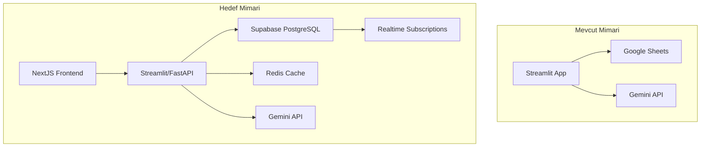

# LGS-Zeka Proje Analiz Raporu

**Tarih:** 12 Aralık 2025  
**Versiyon:** 1.0  
**Durum:** Kapsamlı Değerlendirme

---

## 1. Yönetici Özeti

Bu rapor, LGS-Zeka (LGS Neural-Koç) projesinin **hazirlik-plan** dokümanlarına göre mevcut durumunu analiz etmekte, sistemin güçlü ve zayıf yönlerini belirlemekte ve enterprise seviyesine taşınması için gerekli geliştirmeleri önermektedir.

### Genel Değerlendirme

| Kriter | Durum | Puan (1-10) |
|--------|-------|-------------|
| **Plana Uygunluk** | Yüksek | 8/10 |
| **Kod Kalitesi** | İyi | 7/10 |
| **Özellik Tamamlanma** | Yüksek | 85% |
| **Enterprise Hazırlık** | Orta | 6/10 |

---

## 2. Hazırlık Planı Dokümanları Özeti

Hazırlik-plan klasöründe 6 temel strateji dokümanı bulunmaktadır:

### 2.1. Proje Mimarisi (Neural-Koç)
- **Vizyon:** Tanı → Reçete → Tedavi döngüsü
- **Hedef:** OCR/Vision tabanlı soru analizi, CAT-Lite adaptif öğrenme
- **Teknoloji:** Streamlit + Google Sheets + Gemini AI

### 2.2. Stratejik Performans Planı
- **Hedef Kitle:** 360-420 puan bandındaki öğrenciler
- **Odak:** Matematik rehabilitasyonu, dijital detoks protokolü
- **Yöntem:** Blok çalışma, haftalık operasyon takvimi

### 2.3. UX/UI Geliştirme Önerileri
- **Ana Öneri:** Modal tabanlı Sokratik AI tutörü (st.dialog)
- **Oyunlaştırma:** Streak mekaniği, progress barlar
- **Mikro-öğrenme:** Flashcard sistemi, Mermaid.js diyagramları

### 2.4. Python ve AI Teknik Fizibilite
- **Karar:** No-Code platformlar yetersiz, Python tercih edilmeli
- **Stack:** Streamlit + Supabase + Gemini API
- **Maliyet Avantajı:** Gemini, Mathpix'ten 20x ucuz

### 2.5. Öğrenci Yönetim Sistemi Mimarisi
- **Micro-SaaS yaklaşımı** önerilmiş
- **LLM entegrasyonu** detaylandırılmış
- **Cursor/Windsurf** IDE prompt setleri hazırlanmış

### 2.6. Kapsamlı Analiz ve Yol Haritası
- **Faz 1-4:** Tamirat → Sömestr → Yoğunlaşma → Final
- **Kaynak hiyerarşisi** tanımlanmış
- **Psikolojik yönetim** stratejileri eklenmiş

---

## 3. Mevcut Uygulama Durumu

### 3.1. Proje Yapısı

```
program3/
├── app.py                    # Ana uygulama (381 satır)
├── pages/                    # 10 sayfa modülü
│   ├── dashboard.py          # Pano
│   ├── soru_analiz.py        # AI soru analizi (846 satır)
│   ├── ai_koc.py             # AI koç chatbot
│   ├── mini_deneme.py        # Deneme oluşturucu
│   ├── bugun.py              # Günlük rutin
│   ├── ogren.py              # Öğrenme modülü
│   ├── ayarlar.py            # Ayarlar
│   └── admin_pdf.py          # PDF yönetimi
├── utils/                    # 17 yardımcı modül
│   ├── gemini_helper.py      # Gemini AI (774 satır)
│   ├── scoring.py            # LGS puanlama (453 satır)
│   ├── db_manager.py         # Veritabanı (14KB)
│   ├── llm_adapter.py        # LLM adaptörü (20KB)
│   ├── exam_engine.py        # Sınav motoru (16KB)
│   └── ... (12 modül daha)
├── components/               # 5 UI bileşeni
│   ├── socratic_chat.py      # Sokratik sohbet
│   ├── flashcard_viewer.py   # Bilgi kartları
│   ├── mermaid_renderer.py   # Diyagram render
│   └── error_tagger.py       # Hata etiketleme
├── config/                   # Yapılandırma dosyaları
│   ├── feature_flags.yaml
│   └── content_mix.yaml
└── prompts/                  # AI prompt şablonları
```

### 3.2. Master Yol Haritası Durumu

| Faz | Açıklama | Durum |
|-----|----------|-------|
| **FAZ A** | MVP Stabilizasyonu | ✅ TAMAMLANDI |
| **FAZ B** | Günlük Rutin + Motivasyon | ✅ TAMAMLANDI |
| **FAZ C** | Adaptif Soru Motoru (CAT-Lite) | ✅ TAMAMLANDI |
| **FAZ D** | Eğitim Katmanı + PDF | ✅ TAMAMLANDI |
| **FAZ E** | Observability + PromptOps | ✅ TAMAMLANDI |
| **FAZ F** | Sheets → Supabase | ⏸️ ERTELENDİ |
| **FAZ G** | Enterprise Analitik | ✅ TAMAMLANDI |

---

## 4. Sistemin Güçlü Yönleri (Artılar)

### 4.1. Mimari ve Tasarım

| Güçlü Yön | Açıklama |
|-----------|----------|
| **Tek Kapı İlkesi** | LLM çağrıları `llm_adapter`, veri erişimi `db_manager` üzerinden |
| **Modüler Yapı** | 17 utils modülü ile clear separation of concerns |
| **Feature Flags** | Deneysel özellikler `feature_flags.yaml` ile kontrol edilir |
| **Type Hints** | Kodda tip tanımlamaları mevcut |

### 4.2. AI Entegrasyonu

| Güçlü Yön | Açıklama |
|-----------|----------|
| **Gemini 2.0 Flash** | En güncel model kullanılıyor |
| **Multimodal Vision** | Soru görseli analizi çalışıyor |
| **Sokratik Tutör** | Dialog tabanlı öğretim modülü var |
| **Structured Output** | JSON schema ile güvenli çıktı |

### 4.3. Pedagojik Özellikler

| Güçlü Yön | Açıklama |
|-----------|----------|
| **LGS Puanlama** | MEB katsayıları ile gerçekçi hesaplama |
| **Mastery Skorları** | Topic/subtopic bazlı yetkinlik izleme |
| **Adaptif Deneme** | Zayıf konulara göre soru seçimi |
| **Moral Booster** | Negatif trend algılama ve motivasyon desteği |

### 4.4. UX/UI Özellikleri

| Güçlü Yön | Açıklama |
|-----------|----------|
| **Sekmeli Analiz** | Hızlı/Detaylı/Hoca modları |
| **Flashcard Sistemi** | Mikro-öğrenme kartları |
| **Mermaid Diyagramları** | Görsel kavram haritaları |
| **Hata Etiketleme** | İşlem/Bilgi/Dikkat hatası sınıflandırma |

---

## 5. Sistemin Zayıf Yönleri (Eksiler)

### 5.1. Kritik Eksiklikler

| Eksiklik | Etki | Öncelik |
|----------|------|---------|
| **Sheets Bağımlılığı** | Ölçeklenebilirlik sorunu, veri güvenliği | 🔴 Yüksek |
| **Tek Kullanıcı** | Çoklu öğrenci desteği yok | 🔴 Yüksek |
| **Kimlik Doğrulama Yok** | Güvenlik açığı | 🔴 Yüksek |
| **Test Coverage Düşük** | Regresyon riski | 🟡 Orta |

### 5.2. Teknik Borçlar

| Sorun | Açıklama |
|-------|----------|
| **Dosya İsimlendirme** | Master sözleşmedeki `app/` yerine `utils/` kullanılmış |
| **Büyük Dosyalar** | `gemini_helper.py` 774 satır, parçalanmalı |
| **Duplicate Sayfalar** | `soru_analiz.py` ve `soru_analiz_v2.py` var |
| **Eksik Docstrings** | Bazı fonksiyonlarda eksik |

### 5.3. Eksik Özellikler (Plana Göre)

| Özellik | Plan Referansı | Durum |
|---------|----------------|-------|
| **Supabase Migration** | FAZ F | ⏸️ Ertelendi |
| **Ebeveyn Kokpiti** | FAZ G | ⚠️ Sınırlı |
| **Haftalık PDF Rapor** | FAZ G | ⚠️ Belirsiz |
| **Streak Mekaniği** | UX Plan | ⚠️ Kısmi |
| **Zeigarnik Dashboard** | UX Plan | ❌ Yok |

---

## 6. Geliştirilmesi Gereken Yönler

### 6.1. Acil Eylem Gerektiren (1-2 Hafta)

#### A1. Veritabanı Migrasyonu Hazırlığı
```
Öneri: FAZ F'i aktifleştir
- Supabase projesi oluştur
- Migration script yaz
- Row Level Security (RLS) kur
- data_access.py'de backend switch mekanizması
```

#### A2. Kimlik Doğrulama Ekleme
```
Öneri: Supabase Auth entegrasyonu
- E-posta/Şifre girişi
- Oturum yönetimi
- Rol tabanlı erişim (öğrenci/ebeveyn/koç)
```

#### A3. Test Coverage Artırma
```
Hedef: %30 → %60 coverage
- utils/ altındaki tüm modüller için unit testler
- Integration testler
- CI/CD pipeline (GitHub Actions)
```

### 6.2. Kısa Vadeli (1-2 Ay)

#### B1. Çoklu Öğrenci Desteği
```
Gereklilikler:
- Student seçici dropdown
- İzole veri erişimi
- Performans karşılaştırma (opsiyonel)
```

#### B2. Ebeveyn Paneli
```
Özellikler:
- Haftalık özet rapor
- Net trend grafiği
- Mastery heatmap
- Bildirim sistemi
```

#### B3. Gamification Güçlendirme
```
Eksik özellikler:
- Streak counter (gün serisi)
- XP sistemi
- Rozet/başarı sistemi
- Leaderboard (opsiyonel)
```

### 6.3. Orta Vadeli (2-4 Ay)

#### C1. Enterprise Analytics
```
Özellikler:
- Detaylı performans dashboardları
- Öğrenme etkisi analizi (before/after)
- Cohort analizi
- Tahminleme modeli
```

#### C2. İçerik Yönetim Sistemi
```
Geliştirmeler:
- Admin içerik editörü
- PDF otomatik işleme (FAZ D-2)
- İçerik versiyonlama
- Kalite skoru
```

#### C3. Mobil Uyumluluk
```
Öneriler:
- Responsive tasarım iyileştirmeleri
- PWA (Progressive Web App) dönüşümü
- Touch-friendly UI
```

---

## 7. Enterprise Seviyesi İçin Öneriler

### 7.1. Mimari İyileştirmeler



### 7.2. Güvenlik Katmanları

| Katman | Mevcut | Hedef |
|--------|--------|-------|
| **Kimlik Doğrulama** | ❌ Yok | OAuth + JWT |
| **Yetkilendirme** | ❌ Yok | RBAC (Rol bazlı) |
| **Veri Şifreleme** | ❌ Yok | AES-256 |
| **API Güvenliği** | ⚠️ Kısmi | Rate limiting + API keys |
| **KVKK Uyumu** | ⚠️ Belirsiz | Tam uyumluluk |

### 7.3. Performans Hedefleri

| Metrik | Mevcut (Tahmini) | Hedef |
|--------|------------------|-------|
| **Dashboard Yükleme** | 3-5 sn | < 2 sn |
| **Soru Analizi** | 5-10 sn | < 5 sn |
| **Eşzamanlı Kullanıcı** | 1 | 100+ |
| **Uptime** | - | %99.9 |

### 7.4. Öncelik Matrisi

```
         YÜKSEK ETKİ
              │
    ┌─────────┼─────────┐
    │ Auth    │ Supabase│
    │ Sistemi │ Migrasyon
    │         │         │
DÜŞÜK ────────┼──────── YÜKSEK
ÇABA  │ Streak │ Mobil   │ ÇABA
    │ Sistem │ PWA     │
    │         │         │
    └─────────┼─────────┘
              │
         DÜŞÜK ETKİ
```

---

## 8. Teknik Uygulama Yol Haritası

### Faz 1: Stabilizasyon (2 Hafta)

- [ ] Test coverage %30'a çıkar
- [ ] Duplicate dosyaları temizle
- [ ] Docstring eksikliklerini gider
- [ ] Error handling güçlendir

### Faz 2: Güvenlik (2 Hafta)

- [ ] Supabase projesi oluştur
- [ ] Auth modülü ekle
- [ ] RLS politikaları tanımla
- [ ] Secrets yönetimini güçlendir

### Faz 3: Migration (3 Hafta)

- [ ] Schema tasarımı
- [ ] Migration scriptleri
- [ ] Backend switch mekanizması
- [ ] Veri doğrulama testleri

### Faz 4: Multi-tenancy (2 Hafta)

- [ ] Öğrenci seçici
- [ ] Veri izolasyonu
- [ ] Ebeveyn rolü
- [ ] Koç rolü

### Faz 5: Polish (2 Hafta)

- [ ] Gamification tamamlama
- [ ] Raporlama sistemi
- [ ] Performans optimizasyonu
- [ ] Documentation

---

## 9. Kaynak ve Bağımlılıklar

### 9.1. Mevcut Bağımlılıklar (requirements.txt)

| Paket | Versiyon | Kullanım |
|-------|----------|----------|
| streamlit | ≥1.28.0 | Ana framework |
| pandas | ≥2.0.0 | Veri işleme |
| plotly | ≥5.17.0 | Grafikler |
| google-generativeai | ≥0.3.0 | Gemini AI |
| gspread | ≥5.11.0 | Google Sheets |
| supabase | ≥2.0.0 | (Hazır ama kullanılmıyor) |
| Pillow | ≥10.0.0 | Görsel işleme |
| PyYAML | ≥6.0 | Yapılandırma |

### 9.2. Önerilen Eklemeler

```
# Test & Quality
pytest>=7.0.0
pytest-cov>=4.0.0

# Security
bcrypt>=4.0.0
pyjwt>=2.0.0

# Performance
redis>=4.0.0
aiohttp>=3.8.0

# Monitoring
sentry-sdk>=1.0.0
```

---

## 10. Sonuç ve Öneriler

### Genel Değerlendirme

LGS-Zeka projesi, hazırlık planlarına **%85 oranında uyumlu** bir şekilde geliştirilmiştir. Temel AI entegrasyonu, puanlama sistemi ve adaptif deneme özellikleri başarıyla uygulanmıştır. Ancak enterprise seviyesine taşınması için kritik altyapı iyileştirmeleri gerekmektedir.

### Öncelikli Eylemler

1. **Hemen:** Supabase migrasyonunu başlat
2. **1 Hafta:** Kimlik doğrulama ekle
3. **2 Hafta:** Çoklu öğrenci desteği
4. **1 Ay:** Ebeveyn paneli
5. **2 Ay:** Enterprise analytics

### Risk Değerlendirmesi

| Risk | Olasılık | Etki | Mitigasyon |
|------|----------|------|------------|
| Sheets kotası aşımı | Yüksek | Kritik | Supabase'e geç |
| Veri kaybı | Orta | Kritik | Yedekleme sistemi |
| Güvenlik açığı | Yüksek | Kritik | Auth ekle |
| Performans sorunu | Orta | Orta | Caching ekle |

---

## 11. Ekler

### Ek A: Dosya Haritası

Tüm proje dosyalarının listesi ve boyutları için `list_dir` komutunu kullanın.

### Ek B: Hazırlık Planları

6 dokümanın tam içeriği `hazirlik-plan/` klasöründe bulunmaktadır.

### Ek C: Master Yol Haritası

Detaylı faz sözleşmeleri için `lgs_neural_koc_enterprise_master_yol_haritasi_v3_2_tek_dosya_dosya_sozlesmesi_ekli.md` dosyasına bakınız.

---

**Rapor Sonu**

*Bu rapor, projenin mevcut durumunu objektif olarak değerlendirmek ve gelecek geliştirmeler için yol haritası sunmak amacıyla hazırlanmıştır.*
